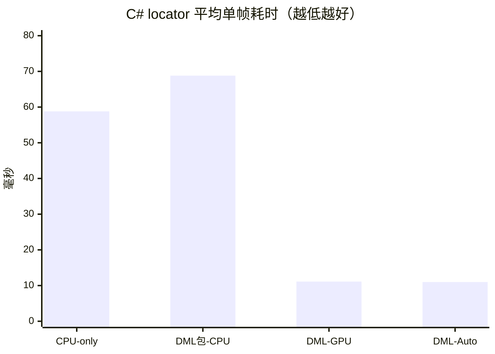

# VRC-Fisher

VRC-Fisher 是一个仅面向 Windows 的 VRChat 钓鱼自动化项目。程序只查找并捕获 `VRChat.exe` 的主窗口，识别咬钩感叹号和小游戏 UI，并通过鼠标控制让移动目标保持在捕获区域内。

> 当前仍是开发中的 MVP。C#/.NET 10/WinUI 3 软件已接入事务启动、VRChat 进程限定捕获、四类双 ONNX 推理、CPU/DirectML、模型管理、自动调频、局内热键、调试覆盖层和 20 种语言。round3 `best.pt` 已固化为 `models/v0.1.0/` 并导出为静态 FP32 ONNX；完整实机自动钓鱼成功率仍需人工验收。

## 从这里开始

- 最终用户：阅读 [使用手册](USER_GUIDE.md)。手册描述首个正式版本的安装和使用方式。
- 新开发者：先按 [开发环境部署](docs/development-setup.md) 安装自己负责部分的环境，再从 [开发文档索引](docs/README.md) 阅读设计约定。
- 准备录屏：阅读 [data_processing/README.md](data_processing/README.md)。
- 训练模型：阅读 [training/README.md](training/README.md)。
- 许可与再分发：阅读 [许可证与发布边界](docs/licensing.md)。

## 发布版安装

正式 Release 发布后，只需下载一个 `VRC-Fisher-Setup-x64.exe`。安装器按 Windows 界面语言从 20 种内置语言中预选；没有匹配语言时使用 English，用户仍可手动改选。安装向导只选择语言、安装目录、快捷方式和是否立即下载模型，不再选择运行组件。DirectML 安装包同时支持 `Auto / GPU / CPU`，软件和全部运行数据位于所选安装目录；不要求用户预装 Python、.NET 或 CUDA。

## 快速使用

1. 在软件“使用指南”页点击本地封面查看 [Fins Fishing](https://vrchat.com/home/world/wrld_ae001ea3-ed05-42f0-adf2-3d47efd10a77/info) 的官方网页信息，再从 VRChat 内进入该世界。
2. 打开 VRC-Fisher，确认两个模型已安装并通过校验。
3. 软件找到 VRChat 主窗口后选择运行设备和工作模式；识别频率始终自动调节。运行模式不显示识别框，调试模式显示经过防抖的识别框和置信度数字。
4. 目标世界的感叹号可能在画面外时，启用“屏外感叹号兜底”并设置 `5–30` 秒等待时间；该功能默认禁用，等待时间默认 `15` 秒。
5. 在 VRChat 前台按启动/停止热键开始自动钓鱼，再按一次停止并释放左键。默认热键为 `F8`，可通过两次确认自由修改；切出 VRChat 会完整停止，返回后不会自动恢复。

当前尚未上传 GitHub Release；本地 `releases/app-v0.1.2/` 与 `releases/models-v0.1.0/` 是供维护者审核的发行物。`app-v0.1.2` Setup 实测为 `57.46 MiB`；最近一次非 C 盘无模型安装实测为 `215.75 MiB`。完整说明和卸载行为见 [使用手册](USER_GUIDE.md)。

## ONNX 性能快照

当前开发机为 Ryzen 7 7840H + RTX 4060 Laptop GPU。正式 C# 检测器在 `2560 x 1600` 测试帧上的平均单帧耗时如下；locator 输入为 `960 x 960`，缓存小游戏裁剪输入为 `640 x 640`。

| 运行模式 | locator | 缓存 minigame | locator + minigame |
|---|---:|---:|---:|
| 历史 CPU-only / CPU | 58.80 ms | 23.68 ms | 108.81 ms |
| DirectML 包 / CPU | 68.81 ms | 28.40 ms | 103.54 ms |
| DirectML / GPU | 11.11 ms | 5.42 ms | 16.17 ms |
| DirectML / Auto | 10.99 ms | 4.95 ms | 15.83 ms |



本机 `Auto` 实际选择 DirectML GPU。表中的独立 CPU-only 构建仅保留为历史基准，当前产品只发布 DirectML 包；其中的 CPU 模式仍使用同一 FP32 ONNX。运行时会分别统计三类负载并在固定边界内调节四个间隔；统计不增加模型调用。完整算法、开销和测量边界见 [性能与存储预算](docs/performance-budget.md) 与 [ONNX Runtime 单帧性能实测](docs/onnx-runtime-benchmark.md)。

## 开发者快速验证

三套工程彼此隔离，不要求一次安装全部工具：

```powershell
# C# 软件
Set-Location app
dotnet restore VrcFisher.sln
dotnet test VrcFisher.sln -c Debug

# 数据处理（Python 3.11 + uv）
Set-Location ..\data_processing
uv sync --locked --extra dev
uv run --offline pytest -q

# NVIDIA CUDA 训练工具（Python 3.11 + uv）
Set-Location ..\training
uv sync --locked --extra dev
uv run --offline pytest -q
uv run --offline vrc-preflight --task all
```

最后一条只检查数据，不启动训练。训练环境使用项目内 PyTorch CUDA wheel，不需要 Miniconda 或全局 CUDA Toolkit；完整前置条件、磁盘占用和故障检查见 [开发环境部署](docs/development-setup.md)。

## 仓库目录

| 目录 | 内容 |
|---|---|
| `app/` | 正式 C# 软件工程与自动化测试 |
| `data_processing/` | 录屏抽帧、全屏标注审计和双数据集生成 |
| `training/` | PyTorch/Ultralytics 训练与 ONNX 导出 |
| `models/` | 随源码仓库公开的已验收 `.pt`、ONNX、模型卡、许可证和校验清单 |
| `packaging/` | C# self-contained publish 与单一 Inno Setup 构建脚本 |
| `releases/` | 本地发布产物，不提交 Git |
| `docs/` | 全部开发者设计文档 |

正式产品使用 C#、.NET 10、WinUI 3 和 ONNX Runtime DirectML；同一安装包内可切换 CPU。Python 与 CUDA 只用于离线数据处理和开发机训练，不进入用户安装包。20 种界面语言资源构建为 `VrcFisher.pri` 后随本体安装，不从 GitHub 单独下载语言包。每个已验收模型版本的 `.pt` 和 ONNX 都提交到 `models/vX.Y.Z/`；GitHub Releases 只是软件按需下载经过校验的 ONNX 的渠道。用户端不发布独立 CPU-only 或 CUDA 组件。

## 许可证

VRC-Fisher 是多许可证项目：原创应用、数据处理和通用工具代码采用 [MIT License](LICENSE)；完整 `training/` 子项目及通过 Ultralytics YOLO11 训练、导出的官方模型按上游标注的 AGPL-3.0 发布；其他组件遵循各自许可证。AGPL 允许商业使用，但分发完整组合或通过网络提供相应服务时必须履行对应源码义务。

录屏、抽帧、标注、审核图和生成数据集默认保持私有，不在 MIT 授权范围内。项目不包含 `vrc-auto-fish` 的代码、模型、图片、标注或文档，只独立实现通用技术思路。完整依赖清单和再分发规则见 [THIRD_PARTY_NOTICES.md](THIRD_PARTY_NOTICES.md) 与 [许可证文档](docs/licensing.md)。开源许可证也不代表 VRChat 或目标世界允许自动化操作，使用者仍需遵守相应规则。

## 当前阻塞

`models/v0.1.0/` 已包含当前最好的 round3 `.pt` 和 ONNX，并由本地模型发布脚本生成对应清单。GitHub Release 仍需维护者审核本地发行物后再创建；真实 VRChat 的 CPU/DirectML 资源占用、识别连续性和自动钓鱼成功率仍需实机验收。
