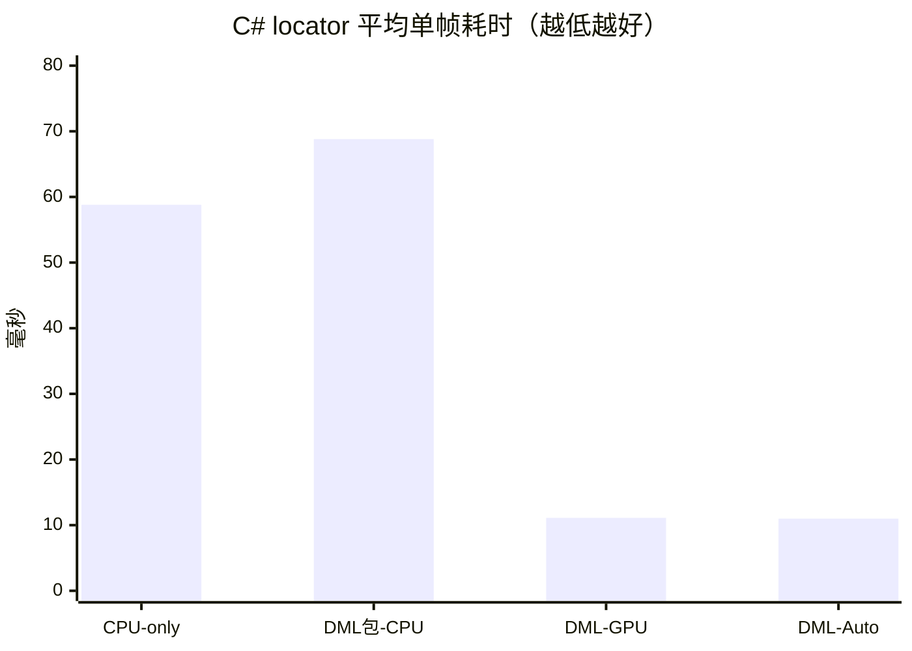
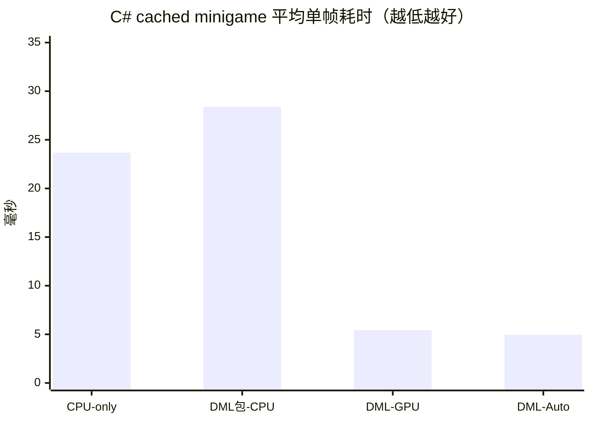

# ONNX Runtime 单帧性能实测

## 1. 结论

本页记录 2026-08-15 在当前开发机上的 FP32 ONNX 实测。模型、输入尺寸、置信度和 NMS 阈值均未降低；正式调度应优先参考 P95。

| 测试构建 / 模式 | locator 平均 / P95 | locator + minigame 平均 / P95 | 缓存 minigame 平均 / P95 |
|---|---:|---:|---:|
| 历史 CPU-only / CPU | 58.80 / 65.21 ms | 108.81 / 119.79 ms | 23.68 / 24.79 ms |
| DirectML 包 / CPU | 68.81 / 73.93 ms | 103.54 / 108.62 ms | 28.40 / 29.55 ms |
| DirectML / GPU | 11.11 / 12.15 ms | 16.17 / 16.92 ms | 5.42 / 5.82 ms |
| DirectML / Auto | 10.99 / 12.37 ms | 15.83 / 16.75 ms | 4.95 / 5.30 ms |

独立 CPU-only 构建已退出产品，只保留为历史对照。当前正式软件应参考 DirectML 包的三组数据：CPU 双模型帧仍需约 `104 ms`，因此运行时按三类 P95 在受限范围内调节；用户可在同一安装包内选择 CPU，不再安装另一套程序。

## 2. 测试条件

| 项目 | 实测条件 |
|---|---|
| CPU | AMD Ryzen 7 7840H，8 核 16 线程 |
| GPU | NVIDIA GeForce RTX 4060 Laptop GPU，8 GB |
| NVIDIA 驱动 | 610.88 |
| 操作系统 | Windows x64 |
| .NET | 10.0.301 |
| C# CPU-only ONNX Runtime | 1.29.0 |
| C# DirectML ONNX Runtime | 1.24.4 |
| Python | 3.11.4 |
| Python ONNX Runtime | 1.28.0 |
| PyTorch / CUDA | 2.13.0+cu130 / CUDA 13.0 运行库 |
| 模型 | 同一组 FP32 ONNX；locator `960 x 960`，minigame `640 x 640` |
| 阈值 | confidence `0.35`，NMS IoU `0.45` |

测试素材是未参与当前模型训练的 `training/test/videos/屏幕录制 2026-08-14 225423.mp4`：

- 第 0 帧：`2560 x 1600`，不含小游戏，用于测量纯 locator。
- 第 1200 帧：`2560 x 1600`，包含小游戏，用于双模型和缓存 minigame；实际裁剪约 `232 x 590`。

旧版基准错误地使用第 1200 帧测量“locator”。检测器在该帧找到小游戏面板后会自动继续运行 minigame，因此旧文档的 C# locator 列实际混入了双模型耗时。本页已经用无面板帧重新测量并替换全部 C# 数据。

## 3. 测量口径

| 名称 | 每次调用实际工作 |
|---|---|
| `locator` | 完整屏幕缩放到 `960 x 960`，只运行 locator，解析感叹号和小游戏面板 |
| `locator + minigame` | 在含面板帧运行 locator，根据检测框裁剪，再运行 minigame |
| `cached minigame` | 使用本轮已锁定的面板区域，只运行 minigame |

C# 每种模式预热 10 次，再连续测量 100 次。计时包含 C# letterbox、BGRA 转 RGB、ONNX Runtime 推理、输出解析、NMS、裁剪视图和坐标映射，不包含 Windows Graphics Capture、界面刷新、状态机和鼠标输入。

`locator + minigame` 是一次完整检测调用的独立实测，不是另外两项平均值的数学相加。不同画面产生的候选框数量、CPU 调频和执行缓存都会影响结果。

## 4. C# 运行链路

### 4.1 完整结果

| 安装组件 / 选项 | 实际 Provider | 模式 | 平均 | P50 | P95 | 平均等效速度 |
|---|---|---|---:|---:|---:|---:|
| 历史 CPU-only / CPU | CPUExecutionProvider | locator | 58.80 ms | 57.99 ms | 65.21 ms | 17.01 FPS |
| 历史 CPU-only / CPU | CPUExecutionProvider | locator + minigame | 108.81 ms | 107.99 ms | 119.79 ms | 9.19 FPS |
| 历史 CPU-only / CPU | CPUExecutionProvider | cached minigame | 23.68 ms | 23.65 ms | 24.79 ms | 42.23 FPS |
| DirectML 包 / CPU | CPUExecutionProvider | locator | 68.81 ms | 68.01 ms | 73.93 ms | 14.53 FPS |
| DirectML 包 / CPU | CPUExecutionProvider | locator + minigame | 103.54 ms | 103.02 ms | 108.62 ms | 9.66 FPS |
| DirectML 包 / CPU | CPUExecutionProvider | cached minigame | 28.40 ms | 28.50 ms | 29.55 ms | 35.21 FPS |
| DirectML / GPU | DmlExecutionProvider | locator | 11.11 ms | 10.97 ms | 12.15 ms | 90.01 FPS |
| DirectML / GPU | DmlExecutionProvider | locator + minigame | 16.17 ms | 16.09 ms | 16.92 ms | 61.86 FPS |
| DirectML / GPU | DmlExecutionProvider | cached minigame | 5.42 ms | 5.42 ms | 5.82 ms | 184.50 FPS |
| DirectML / Auto | DmlExecutionProvider | locator | 10.99 ms | 10.80 ms | 12.37 ms | 90.96 FPS |
| DirectML / Auto | DmlExecutionProvider | locator + minigame | 15.83 ms | 15.78 ms | 16.75 ms | 63.19 FPS |
| DirectML / Auto | DmlExecutionProvider | cached minigame | 4.95 ms | 4.97 ms | 5.30 ms | 202.02 FPS |

“平均等效速度”只是 `1000 / 平均毫秒`，表示连续只运行该模式的理论上限，不等于软件或 VRChat 的画面帧率。

### 4.2 平均耗时图

### 4.3 初始化耗时

| 安装组件 / 选项 | 实际 Provider | 两个会话初始化 |
|---|---|---:|
| CPU-only / CPU | CPUExecutionProvider | 308.32 ms |
| DirectML 包 / CPU | CPUExecutionProvider | 259.61 ms |
| DirectML / GPU | DmlExecutionProvider | 1030.06 ms |
| DirectML / Auto | DmlExecutionProvider | 1039.94 ms |

初始化只发生在检测器启动或切换模型时，不计入单帧调度。该数字容易受驱动缓存、文件缓存和测试顺序影响，只用于估算启动等待。

## 5. 优化效果

优化没有改变模型和识别参数，主要包括：

- 复用 locator 与 minigame 的固定输入 Tensor，避免每帧分配约 10.55 MiB 和 4.69 MiB。
- 直接写连续 CHW 缓冲，缓存双线性缩放坐标，不再通过四维 Tensor 索引器逐值写入。
- minigame 直接读取完整帧中的裁剪视图，不再复制一张 BGRA 裁剪图。
- 直接从 ONNX 输出 Span 解析候选框，不再复制完整输出并为每一行创建数组。
- CPU-only ONNX Runtime 从 1.24.4 升级到 1.29.0；DirectML 保持其当前可用的 1.24.4。

| Provider / 模式 | 优化前平均 | 优化后平均 | 降低 |
|---|---:|---:|---:|
| CPU-only / locator | 115.64 ms | 58.80 ms | 49.2% |
| CPU-only / locator + minigame | 158.90 ms | 108.81 ms | 31.5% |
| CPU-only / cached minigame | 45.78 ms | 23.68 ms | 48.3% |
| DirectML GPU / locator | 49.93 ms | 11.11 ms | 77.8% |
| DirectML GPU / locator + minigame | 75.64 ms | 16.17 ms | 78.6% |
| DirectML GPU / cached minigame | 22.03 ms | 5.42 ms | 75.4% |

纯 CPU Session 的额外诊断表明，优化后绝大部分 CPU 时间已经位于 FP32 模型计算本身，C# 前后处理不再是主要瓶颈。线程扫描中 8 线程的平均值和 P95 最均衡：12 线程平均略快但 P95 变差，16 线程出现明显抖动，因此没有增加线程数。

## 6. Python 开发链路对照

Python 数据只用于训练后的预标注和审核。它包含 Ultralytics 图像预处理、ONNX 推理和后处理，不包含视频解码与绘框；每种模式预热 5 次，再测量 50 次。

| Provider | 模式 | 平均 | P50 | P95 | 平均等效速度 |
|---|---|---:|---:|---:|---:|
| CPUExecutionProvider | locator | 61.44 ms | 61.12 ms | 65.80 ms | 16.28 FPS |
| CPUExecutionProvider | cached minigame | 26.88 ms | 26.43 ms | 29.12 ms | 37.20 FPS |
| CPUExecutionProvider | locator + minigame | 115.61 ms | 115.33 ms | 131.01 ms | 8.65 FPS |
| CUDAExecutionProvider | locator | 13.75 ms | 13.80 ms | 14.99 ms | 72.73 FPS |
| CUDAExecutionProvider | cached minigame | 8.97 ms | 8.92 ms | 9.66 ms | 111.48 FPS |
| CUDAExecutionProvider | locator + minigame | 21.71 ms | 21.61 ms | 22.77 ms | 46.06 FPS |

优化后的 C# 已与 Python CPU/CUDA 处于同一量级，在本机这些单帧测试中略快。两套管线的库版本和 GPU Provider 不同，因此该对照只能说明 C# 前后处理瓶颈已经消除，不能用于宣称某种语言天然更快。

## 7. 调度含义与限制

1. 历史 CPU-only 数据只用于比较 ONNX Runtime 版本，不再对应可发布组件。
2. DirectML 包强制 CPU 的 locator / 双模型 / 缓存小游戏 P95 为 `73.93/108.62/29.55 ms`，可在同一软件内直接选择。
3. CPU 双模型 P95 仍约 `109-120 ms`。按 `P95 / 0.80` 和 `P95 x 4`，本机 CPU 的 Hooking 与面板复查初值取 `150/500 ms`，必须在真实 VRChat 中重点观察。
4. DirectML 在本机对 `80 ms` locator、`80 ms` Hooking、`33 ms` minigame 和 `250 ms` 面板复查有充足余量。
5. 已实现的自适应只调节有上下限的运行频率，不采用 INT8、FP16、降低输入尺寸、降低模型精度或修改阈值。它不改变本页的原始单帧基准结果。

这些结果只代表当前电脑、模型、输入尺寸、两张测试帧和空载离线环境。最终发布前还要在真实 VRChat 负载下记录端到端帧龄、CPU/GPU 占用、显存、丢帧率以及多帧 P95；TensorRT、C# CUDA Execution Provider 和其他显卡没有纳入本轮测试。
